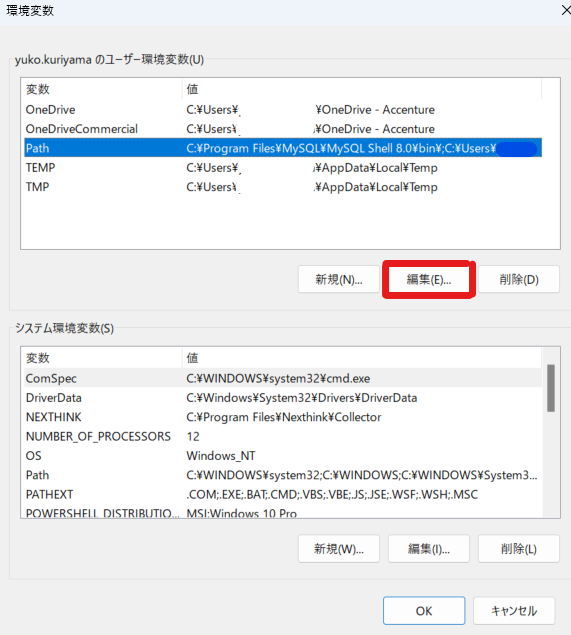

#　Kyoto Scenery Review Tool (だれもが簡易に利用できる景観検討ツール)

##　≪目次≫
1. 目的
1. 使用ソフト
1. 作業手順
1. トラブルシューティング
1. 参考資料

---
##  目的
京都市景観ツールを使用するにあたり、必要な環境設定を行う。


---
##  使用ソフト
* Python 3.10
* Blender 3.3（Portable版）
* VS Code

---
##  作業手順
### 1．使用ソフトの準備
####    1.1．Python環境のセットアップ
-   Pythonがインストールされていない場合は、[Pythonの公式ウェブサイト](https://www.python.org/downloads/)からインストーラーをダウンロードしてインストール。
-   .envファイルを作成。
    -   プロジェクトのルートディレクトリに.envという名前のファイルを作成。
    -   .envファイルには、必要な環境変数を設定する。
    ```python
    # 例）
    # ここでyour_api_keyは実際のAPIキーに置き換えてください。
    API_KEY=your_api_key
    ```
&nbsp;

####    1.2．Blender 3.3（Portable版）のインストール
-   [Blender公式HP](https://www.blender.org/download/lts/3-3/)より、Blender 3.3のPortable版をダウンロードしてインストール。
&nbsp;

####    1.3．VS Codeのインストール
-   [VS Code公式HP](https://code.visualstudio.com/)より、ダウンロードしてインストール。
-   Blenderと連携する。
    -   参照動画： [5 Steps to setup VSCode for Blender Python (on Windows)](https://www.youtube.com/watch?v=YUytEtaVrrc)
-   Live Serverのインストールを行う。
    -   参照サイト： [VS Codeを用いた簡易Webサーバー構築(zenn.dev)](https://zenn.dev/tasiten/articles/3b92505d764e42)
    ※これでindex.htmlファイルが使えるようになり、(http://localhost:5500)などにアクセス可能となる。
&nbsp;

### 2．京都市景観ツール（チャットボット）の起動
-   xxxxフォルダをローカルへダウンロード 
  ※GitHub？のURLを挿入予定
    - 以下、xxxxフォルダ内のファイル
      -   main.py
      -   tools.py
      -   paramas.py
      -   etc..
-   ターミナルで以下のコマンドを実施し、アプリケーションの起動に必要なパッケージ（requirements.txtに記載されているパッケージ）を一括インストールする。
    ```python
    pip install -r requirements.txt
    ```
-   ターミナルで以下のコマンドを実行し、アプリケーションを起動。
    ```python
    streamlit run main.py
    ```
-   チャットボットにメッセージを送信
&nbsp;

### 3．京都市景観ツール（チャットボット）とBlenderの連携
-   設定より「システム環境変数の編集」を選択。
    
    &nbsp;
- 「Accenture Business」を理由としてシステムのプロパティを開き、環境変数を選択。
    
    &nbsp;
-   Pathの編集を選択し、環境変数名の編集においてblenderのファイルパスを新規追加。
    
    
    &nbsp;
-   PCを再起動。


---
##  トラブルシューティング


---
##  参考資料
#### 1．Blender ジオメトリノードについての学習ビデオ
- [Master the Basics of Blender Python for Geo Nodes in Just One Video](https://www.youtube.com/watch?v=Is8Qu7onvzM&ab_channel=CGPython)
  ※こちらのビデオで共有されているコードを実行する場合、Blenderの言語が日本語ではエラーが発生するため、英語に設定する。
- [Free Building Generator | Buildify 1.0 | Blender 3.3 Tutorial](https://www.youtube.com/watch?v=FqmZQPGf91A&ab_channel=MKGraphics)
